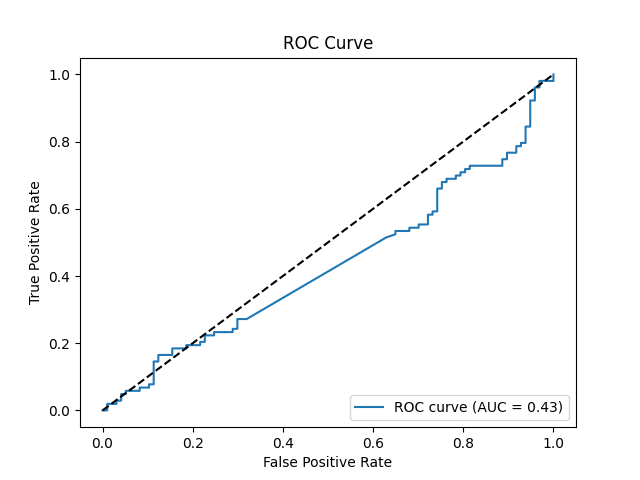
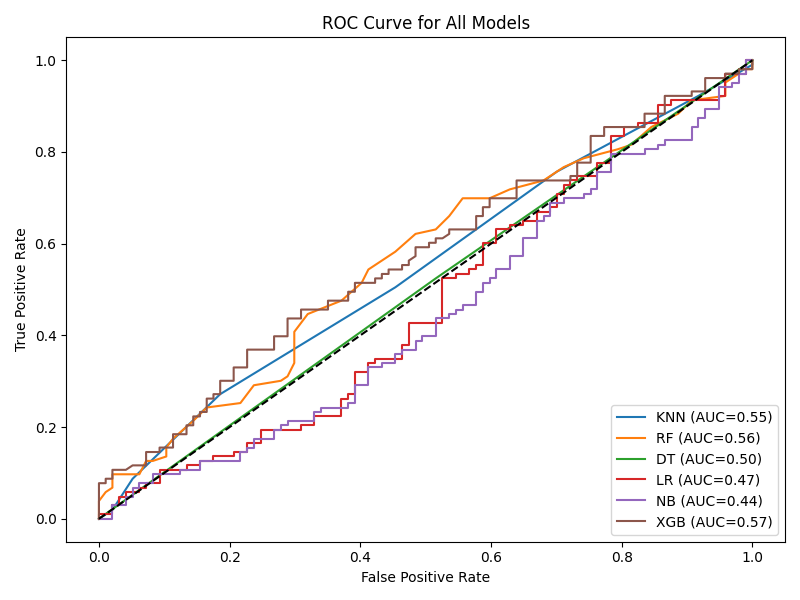
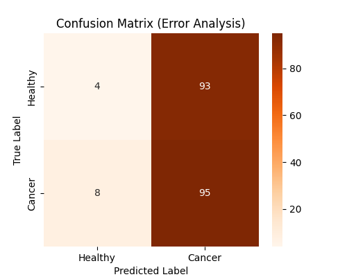

# 🧬 Meta-Gastric-Classifier

A modular and professional gastric cancer classification system based on an improved Support Vector Machine (SVM) optimized using the Archimedes Optimization Algorithm (AOA), alongside comparison with classic machine learning algorithms.

This project was implemented by **Alireza Rostami** as a practical exercise to strengthen skills in AI for healthcare, machine learning pipelines, visualization, reproducible experimentation, and understanding scientific research in this domain.

---

## 🎯 Objective

This project aims to replicate, analyze, and extend the research presented in the following scientific article:

> **"A New Hybrid Support Vector Machine with Archimedes Optimization Algorithm for Gastric Cancer Detection"**  
> 📄 DOI: [10.13005/bbra/3347](http://dx.doi.org/10.13005/bbra/3347)

The goal was to:
- Re-implement the proposed SVM+AOA method in Python
- Compare its performance with other ML models
- Visualize results and conduct error analysis
- Build a user-friendly Streamlit interface
- Practice end-to-end ML engineering on a medical dataset

---

## 🗂 Project Structure

```

Meta-Gastric-Classifier/
├── data/                  # Dataset (e.g. gastric.csv)
├── models/                # Trained models (joblib)
├── reports/               # Classification reports & plots
├── notebooks/             # EDA and experimental notebooks
├── src/                   # Main code modules
│   ├── aoa\_optimizer.py   # Archimedes Optimization Algorithm
│   ├── model\_trainer.py   # SVM+AOA trainer
│   ├── benchmark.py       # Baseline model trainers
│   ├── data\_loader.py
│   ├── visualizer.py
│   ├── evaluator.py
│   ├── error\_analysis.py
│   ├── feature\_selector.py
│   └── logger.py
├── streamlit\_app.py       # Streamlit GUI
├── main.py                # CLI runner
├── requirements.txt
└── README.md

````

---

## 🚀 Getting Started

### 🐍 Virtual Environment (optional but recommended)
```bash
python -m venv .venv
source .venv/bin/activate  # or .venv\\Scripts\\activate on Windows
pip install -r requirements.txt
````

### 📦 Run main Python pipeline

```bash
python src/main.py
```

### 🎛 Launch Streamlit GUI

```bash
streamlit run streamlit_app.py
```

---

## 🔍 Models Implemented

| Model Name                | Description                                                           |
| ------------------------- | --------------------------------------------------------------------- |
| **SVM + AOA**             | Support Vector Machine optimized by Archimedes Optimization Algorithm |
| K-Nearest Neighbors (KNN) | Classical distance-based classifier                                   |
| Random Forest (RF)        | Ensemble of decision trees                                            |
| Decision Tree (DT)        | Simple decision-based classifier                                      |
| Logistic Regression (LR)  | Linear probabilistic classifier                                       |
| Naive Bayes (NB)          | Probabilistic model                                                   |
| XGBoost (XGB)             | Gradient-boosted decision trees                                       |

---

## 📊 Outputs

* Accuracy, classification reports (CSV)
* Confusion matrices (heatmaps)
* Precision-Recall curves
* ROC curves (individual + combined)
* PCA scatter plot of dataset
* Error analysis (misclassified sample summary)

---

## 📈 Example Visuals

| Visual Type      | Example Output                          |
| ---------------- | --------------------------------------- |
| ROC Curve        |              |
| Confusion Matrix |  |
| All Model ROC    |   |
| Error Matrix     |   |

---

## 🧪 Why This Project?

> I developed this project as a personal study to:
>
> * Strengthen my practical understanding of machine learning in medical data
> * Explore scientific optimization algorithms like AOA
> * Improve pipeline design, modular coding, and visual analytics
> * Reproduce a real research paper and evaluate its method
> * Practice building GUI apps for ML using Streamlit

---

## 👨‍💻 Author

**Alireza Rostami**
🎓 Computer Engineering Student

🌐 [GitHub: Alireza-R-9](https://github.com/Alireza-R-9)

---

## ✅ Future Enhancements

* [ ] Feature importance analysis
* [ ] Threshold tuning & calibration
* [ ] Deployment on Streamlit Cloud
* [ ] Auto-generated PDF report
* [ ] Unit tests for critical modules

---

## 📄 License

This repository is intended for academic and educational use.
